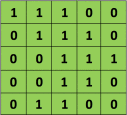

### Convolution
convolution首先要定义一个kernel的矩阵，然后一步一步的对整个图片进行映射，并计算，例如，下面的图片，
kernel矩阵为[[1,0,1][0,1,0],[1,0,1]]（这个在权值W中设定形状，例如第一层的[5,5,1,32]，kernel就是一个5×5×1的矩阵，
后面的32表示映射出来的举证的代谢哦啊），在原始图片上一步一步（通过stride参数设定）的移动这个kernel矩阵，最后对下图的映射接:  

原始矩阵  
  

kernel矩阵  
  
 
卷积之后  
  

## Pooling

## 结构

## 代码实现